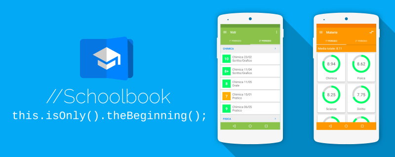

# Welcome to Schoolbook
Schoolbook is an app that simplify your school organization.
It connects with ClasseViva online register and shows your datas *beautifully* and *simply*.

##Schoolbook supports:
* Calendar
* Votes
* Subjects
* Comunications
* Notes
* Arguments

##Features
* Dashboard with last school events
* Reminds assistant (Currently in developing)
* Filter your grades by subject and votes
* Rich detail of subjects with medium, charts and objectives
* Compare the subjects of the first period with those of the second
* Download and view PDF comunications

##Future additions
* Reminds will help you with your homeworks, prepare your schoolbag and organize your day for tests
* Votes' analysis and statistics tools
* Classroom's online chat
* File section

##Contributing
Pull requests are welcome.

## License
Schoolbook is released under Apache License Version 2.0
    
    Copyright 2016 Marco Cimolai
    
    Licensed under the Apache License, Version 2.0 (the "License");
    you may not use this file except in compliance with the License.
    You may obtain a copy of the License at

        http://www.apache.org/licenses/LICENSE-2.0

    Unless required by applicable law or agreed to in writing, software
    distributed under the License is distributed on an "AS IS" BASIS,
    WITHOUT WARRANTIES OR CONDITIONS OF ANY KIND, either express or implied.
    See the License for the specific language governing permissions and
    limitations under the License.

